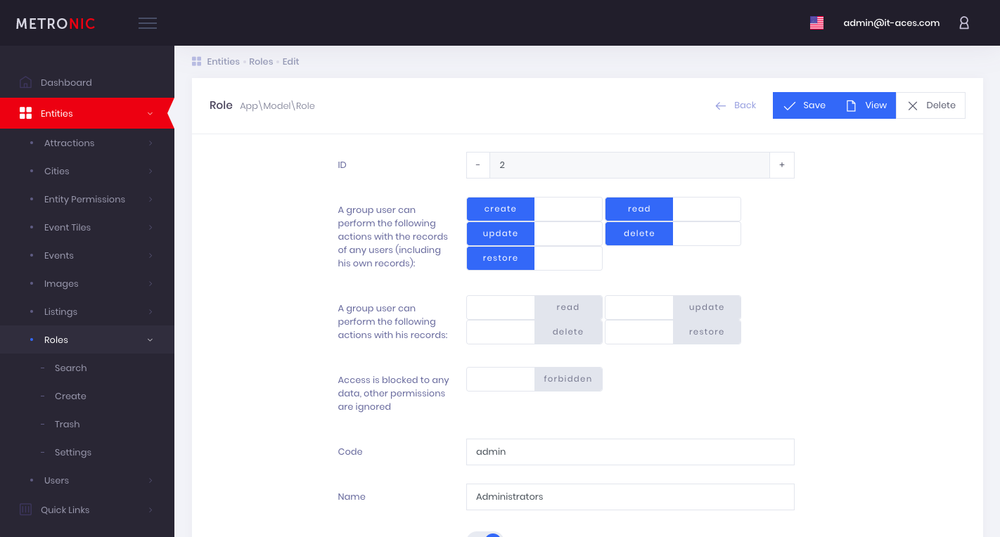

# Admin Panel from IT Aces team for Laravel Framework with Doctrine ORM



## Dependencies

 * [orm-backend/laravel-doctrine](https://github.com/orm-backend/laravel-doctrine)
 * [orm-backend/laravel-doctrine-acl](https://github.com/orm-backend/laravel-doctrine-acl)

If you are building an application from scratch you may need to install the [orm-backend/laravel-doctrine-web](https://github.com/orm-backend/laravel-doctrine-web). It contains basic controllers and resources for registration and authorization. In other case your application must have implemented login page.

## Install

* Add composer repositories

```BASH
"repositories": [
	{
       "type": "vcs",
       "url": "git@github.com:orm-backend/laravel-doctrine.git"
    },
    {
       "type": "vcs",
       "url": "git@github.com:orm-backend/laravel-doctrine-acl.git"
    },
    {
       "type": "vcs",
       "url": "git@github.com:orm-backend/laravel-doctrine-web.git"
    },
    {
       "type": "vcs",
       "url": "git@github.com:orm-backend/laravel-doctrine-admin.git"
    }
]
```

* Install packages

If you have not previously installed the [orm-backend/laravel-doctrine-web](https://github.com/orm-backend/laravel-doctrine-web) package, do it now. See the installation instructions for the required packages for how to install and compile them.

```BASH
composer require orm-backend/laravel-doctrine-web
```

```BASH
composer require orm-backend/laravel-doctrine-admin
```

* Publising

```BASH
php artisan vendor:publish --provider="OrmBackend\Admin\PackageServiceProvider"
```

## Setting up

config/app.php

```BASH
//Illuminate\Auth\Passwords\PasswordResetServiceProvider::class,
LaravelDoctrine\ORM\Auth\Passwords\PasswordResetServiceProvider::class,
```

```BASH
OrmBackend\ORM\DoctrineServiceProvider::class,
LaravelDoctrine\Extensions\BeberleiExtensionsServiceProvider::class,
```


